# Debugging JavaScript Without the Browser

## Learning Goals
- Have an introductory understanding of how to debug JavaScript run without a browser
- Have an introduction to Google Chrome's debugging tools
- Have an introductory understanding of how to set and unset a breakpoint

In this lecture, we're going to look at one way to debug JavaScript code. We will essentially work with the following process:

1. Setup a scenario we'd like to debug
1. Attach our code to a debugger
1. Launch the debugger and learn how to stop execution, inspect state, and resume execution

## Setup

Say you're working on code that takes in two input numbers using `prompt` and checks if it's odd. Take a look at the file `debugging-activity.js`.

Go ahead and run it a few times with `$ node debugging-activity.js`, and check out the behavior after you give it some input.

## Attach to a Debugger

Once we get to using JavaScript in the browser, we'll have a very streamlined workflow for debugging. However, before we get to the browser, one simple way of using a debugger is to use node's built in features to attach to Google Chrome's debugger.

Try running your code now with the command `$ node --inspect debugging-activity.js`.

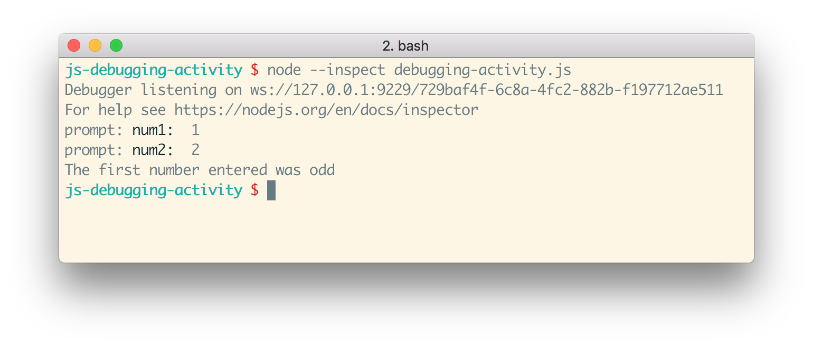

Notice two things:
1. There is a new line of output at the beginning now that says `Debugger listening on ws://127.0.0.1: ...`
1. Otherwise, the code runs all the same. You can proceed with the whole script as before

Open up Google Chrome and go to the URI `chrome://inspect`. Observe that when you are not running any scripts with `node --inspect`, the list of Remote Targets is blank... and when you _are_ running the `debugging-activity.js` code, there _is_ a new item listed under Remote Targets.

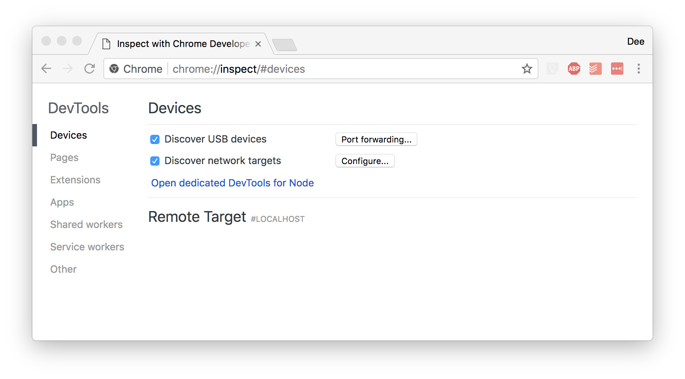
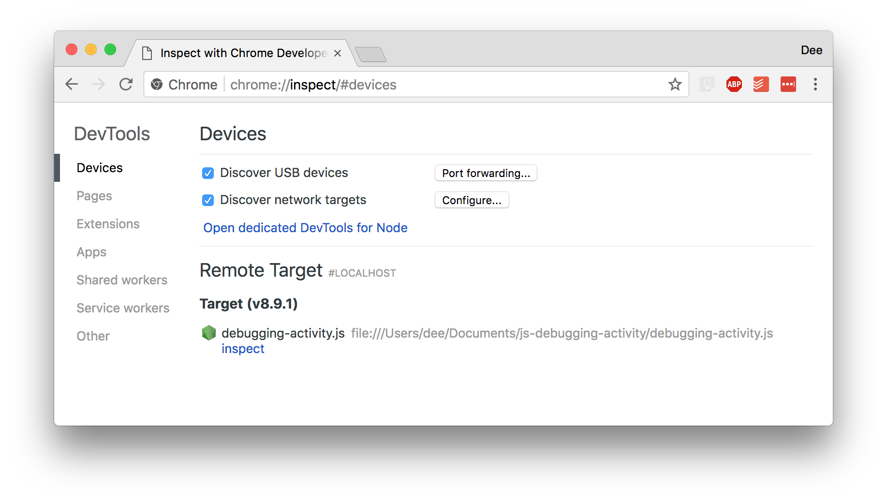

Identify the listing under Remote Targets that relates to your running JavaScript, and click on "Inspect". This should open up the Google Chrome Developer Tools.

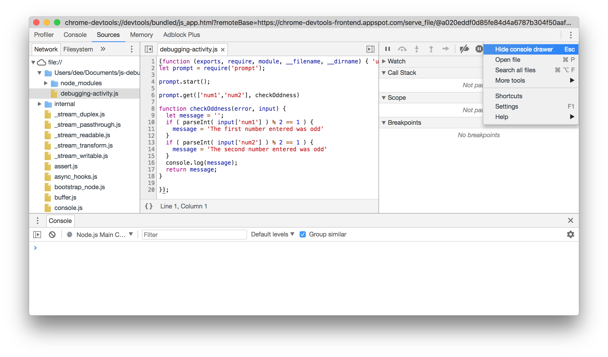

In the Google Chrome Developer Tools, navigate to the tab labeled "Sources".

When you go to the "Sources" tab, you should see a window pane on the left side with its own tabs. If your window does not have the tab named "Network" with `file://` listed under it, then select the tab "Filesystem". Select the button "Add folder to workspace". This should open up a file system prompt-- select the project directory of this project (`js-debugging-activity`) located on your computer and press "select".

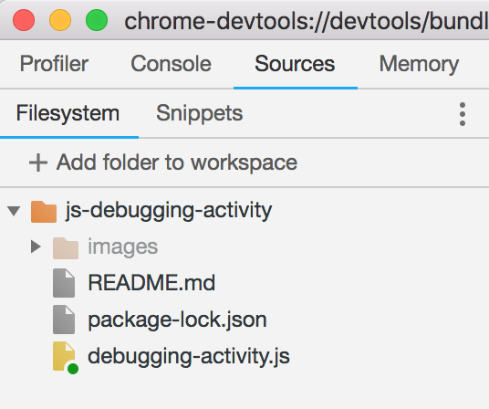

Now, take a moment to familiarize yourself with the window, and identify the following things:

1. On the left hand side, the file navigator, that will help you navigate to a representation of your `debugging-activity.js` file on your local machine
1. In the middle panel, the workspace where open files can be viewed and interacted with
1. The right hand side, which allows detailed views of what's going on in the code execution, namely, controls for breakpoints. It's recommended to configure the view to the following:
    - Collapsing the section called "Call Stack"
    - Expanding the sections "Scope" and "Breakpoints"
1. It's useful (often necessary) to have the Console Drawer open. If it's not open by default on your inspector, use the kabob menu (three dot/vertical ellipses icon) to toggle the Console Drawer.

## Make Breakpoints to Pause Code

Take a look again at our code. There's conditional logic that gets evaluated and local variables that get assigned and reassigned to all consider. Wouldn't it be nice to have a way to _pause_ code execution and check what state is at that point?

Breakpoints are our way of telling our code, "Pause, let me look at you in the debugger, until I resume."

To create a breakpoint, we identify the line of code we want to pause at, and then click on its line number to the left of it. Clicking on this should toggle the breakpoint: indicated by the presence of a blue arrow. Go ahead and add a breakpoint to line 17.

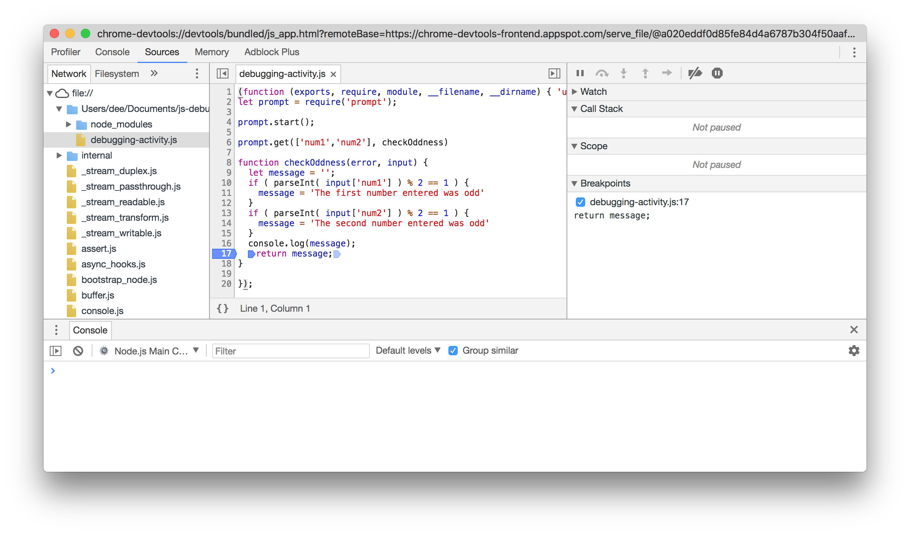

While continuing to see the Google Chrome Dev Tools window, bring back up Terminal so we can observe the code hit the breakpoint. At this moment, your Terminal should still be in a state waiting for input via use of `prompt`. Go ahead and give it some input and upon giving it a second number...

You should see on the Google Chrome Dev Tools window that the code has stopped execution _**before**_ it executed line 17.

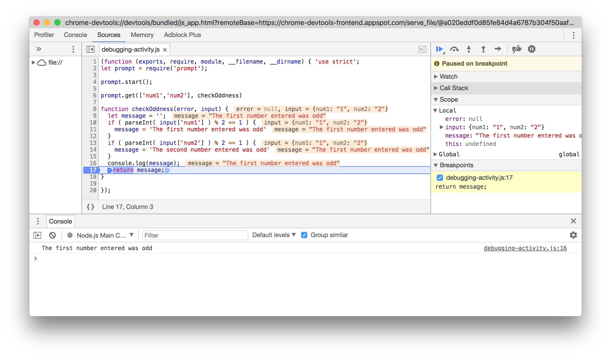

Take a second to check out the changes in the entire window. What do we see in the "Scope" section?

## Resuming Code Until the Next Breakpoint

Once we've felt comfortable seeing the state of the code before line 17 was executed, go ahead and observe the breakpoint controls in the top right corner.

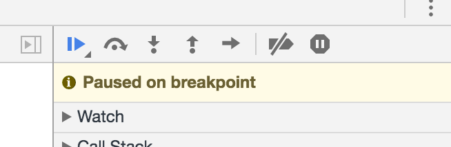

We'll spend some time working with these tools more in depth later, but the one action we'll look at is the play button for resuming script execution. Go ahead and press it!

What happened when you pressed it? The rest of the code executed, and then the script ended and stopped. In Terminal, you should observe the output "Waiting for the debugger to disconnect...". To re-run the script, you'll have to close this debugger window, and then re-run in Terminal `node --inspect debugger-activity.js`.

### Practice More Breakpoints

We can add as many breakpoints as we'd like. As the codebases we work with get larger and larger, this will become more apparently useful. For now, let's re-run our script with `--inspect`, re-open our Dev Tools debugger window, and put breakpoints at lines 11, 14, and 17.

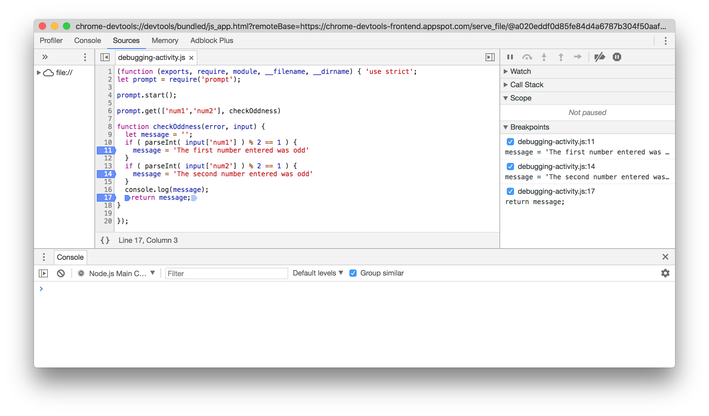

Does every breakpoint get hit each time you run the script? What happens when you have multiple breakpoints?

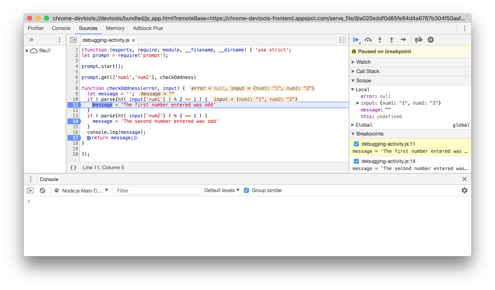

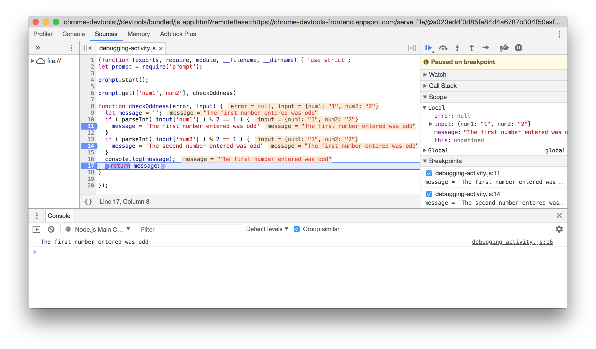

## One Important Note: Pausing Code On the First Line When Using `--inspect`

This code sample was pretty (intentionally) lucky-- we used `prompt`, which paused the code execution while it waited for our user input in Terminal... giving us enough time to go to Google Chrome, go to `chrome://inspect`, load up the Dev Tools window, set some breakpoints, get a coffee... How do we get the code to give us time to set breakpoints if we run the code using the `node` command in the Terminal?

In most cases, our scripts run and finish faster than we can blink. We can use the command `$ node --inspect-brk debugging-activity.js` to **pause code execution at the first line of the script** until we've set up our debugger and pressed "play."

**For most of the JS files that we will debug this way** (JS not in the browser) **, it will make more sense to use this command.**

## Conclusion

We'll learn more deeply how to use the Chrome Dev Tools Debugger later, but for now, being able to attach to a debugger, create breakpoints, and observe the state of our variables at any given moment, should prove useful for debugging JavaScript.

### Summary

1. Run your code with `node --inspect yourfile.js` **or more likely `node --inspect-brk yourfile.js`**
1. In Google Chrome, go to `chrome://inspect`
1. Open up the Remote Target that refers to your code with the Inspect button
1. In the Dev Tools window, set breakpoints to pause code execution
1. Resume code execution with the play button
